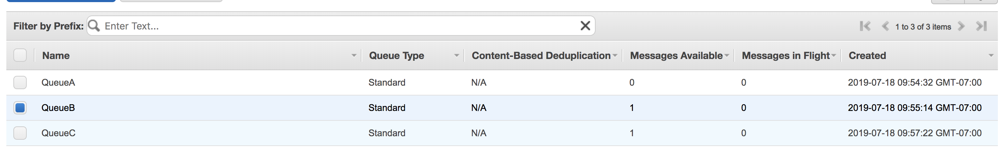

# SQS Application
Uses AWS Simple Queue Service that accepts message and sends it to the corresponding queue.

## Setting-up
1. Add AWS SQS Full access to the user policy.
2. Go to Simple Queue Service Console.
3. Click the Create Queue on the top left button.
4. Select the Standard Queue.
5. Take note of the URL for the queues.
6. Create a gradle java application.

## Dependency
```
dependencies {
    implementation platform('com.amazonaws:aws-java-sdk-bom:1.11.228')
    implementation 'com.amazonaws:aws-java-sdk-sqs'
}
```

## Running the code
* Clone the repo and run ```./gradlew run```

## Source Code
* Reference: https://github.com/awsdocs/aws-doc-sdk-examples/blob/master/java/example_code/sqs/src/main/java/aws/example/sqs/SendReceiveMessages.java

## Testing the application

